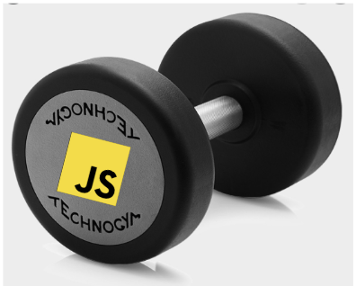

# CWreps

Since I started programming I've really enjoyed doing algorithmic code challenges.

I feel like its the best way to learn new language features, solidifies CS fundamentals and allows you challenge yourself to get outside of your comfort zone. Not to mention it makes you a better programmer after you do enough of them.

I prefer using my own IDE for answering these so I started a repo documenting my answers, but made the function names and folder titles obscure enough to make them unsearchable back to the original questions so others can't use my answers to cheat!

Do your own reps!!

